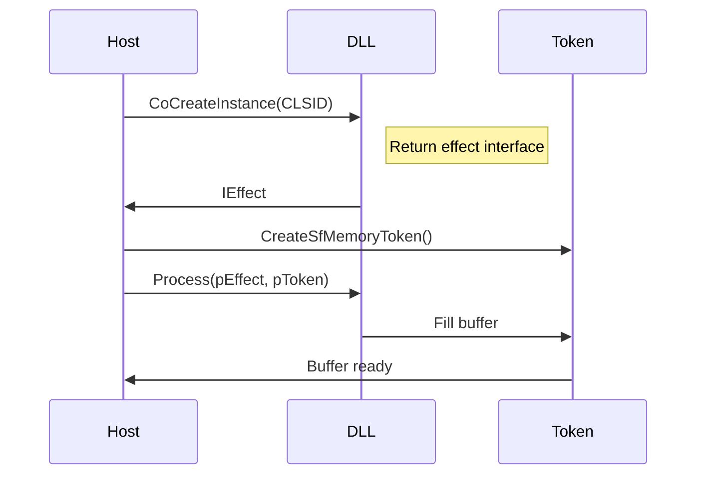

# VEGAS Shared Plug‑Ins – полное разбор и план реверса Sound Forge‑плагинов

> **Дата**: 2026‑08‑07
> **Автор**: OpenVegas reverse‑engineering team
> **Описание**: Полный отчёт о формате, структуре и способах обращения к динамическим DLL‑м, поставляемым в VEGAS Pro и Sound Forge. Цель – дать основу для реализации аналогов в OpenVegas и построения безопасного/свободного кода, а не прямой копии.

---

## 1. Инвентарь на диске

Набор файлов находится в:

```
C:\Program Files (x86)\VEGAS\Shared Plug-Ins\Audio_x64\
```

| Файл | Размер | Тип | Комментарий |
|------|--------|-----|-------------|
| apluginsk.dll | 10 730 528 байт | Ядро | Внутренний runtime‑kit, экспортирует ~1300 символов, содержит всю DSP‑логику, UI‑тулкиты и вспомогательные функции.
| Errorreport.dll | 130 128 байт | Помощник | Крауд‑чекер и логгер.
| mchammer_x64.dll | 359 984 байт | Эффект – Wave Hammer 5.1
| sffrgpnv_x64.dll | 267 344 байт | Эффект – Sound Forge Pro Pan and Volume 1
| sfppack1_x64.dll | 791 088 байт | Эффект‑пак 1 – Chorus/Reverb/Pitch Shift
| sfppack2_x64.dll | 907 312 байт | Эффект‑пак 2 – Graphic/Parametric/Paragraphic EQ
| sfppack3_x64.dll | 589 360 байт | Эффект‑пак 3 – Flange/Distortion
| sfresfilter_x64.dll | 301 104 байт | Resonant Filter
| sftrkfx1_x64.dll | 589 856 байт | TrackFX 1 – Track EQ/Compressor/Noise Gate
| sfxpfx1_x64.dll | 362 024 байт | ExpressFX 1 – Chorus/Distortion/Flange/Reverb
| sfxpfx2_x64.dll | 366 120 байт | ExpressFX 2 – Delay/Simple Delay/EQ
| sfxpfx3_x64.dll | 425 512 байт | ExpressFX 3 – AM/Smooth‑Enhance/Vibrato
| xpvinyl_x64.dll | 272 456 байт | ExpressFX Audio Restoration

> **Сверка**: Все DLL‑ы в каталоге совпадают со списком, описанным в `src/plugins/VegasSharedAudioCatalog.cpp` – в коде OpenVegas каталог не нуждается в правках.

---

## 2. Формат бинарников – почему их нельзя просто `LoadLibrary`

### 2.1 COM‑подключение

Все 12 «эффектных» DLL – **COM in‑process сервера**. Т.е. единственный публичный вход – `DllGetClassObject(CLSID, IID, &ppv)`. После `CoCreateInstance` вы получаете указатель на интерфейс, через который проходит весь обмен.

* Внутри DLL нет прямых экспортов, относящихся к конкретному эффекту.  Эффект‑классы реализованы как отдельные CLSID внутри одной DLL.

* Экспортируемые функции (`DllCanUnloadNow`, `DllGetClassObject`, `DllRegisterServer`, `DllUnregisterServer`, `DllMain`) — это базовый COM‑шаблон.

* Пример списка экспортов (`objdump -x`) одинаков для всех, за исключением `sftrkfx1_x64.dll`, у которой два дополнительных экспорта: `CSfDither` и функции для работы с Wingdings‑шрифтом.

### 2.2 Токен обмена памятью

Большая часть внутренней коммуникации реализована через два класса: `CMappingOfSfMemoryToken` и `COutOfProcessMemoryToken`. Это механизм shared‑memory‑токенов, позволяющий передавать звуковые буферы между процессами. Имеется отдельный поток (или процесс), обрабатывающий аудио, что повышает стабильность хоста.

* `CMappingOfSfMemoryToken` – объект‑маппинг памяти.
* `COutOfProcessMemoryToken` – управляет внешним (out‑of‑process) токеном.

### 2.3 Что значит

* **Не VST**, не OFX – это собственный proprietary COM‑подход.
  > **Опровергнуто (2026-08-22).** Подход не собственный: за каждым CLSID стоит обычный
  > **DirectShow transform filter** со стандартными `IBaseFilter` / `IMemInputPin` /
  > `IPersistStream` / `ISpecifyPropertyPages`. Ничего реверсить не потребовалось —
  > подробности и замеры в §6б.
* **Нельзя просто `LoadLibrary`** и вызвать `DllMain` – необходимо пройти `CoCreateInstance` для конкретного CLSID.
* **Данные не экспортируются**: аудио‑блоки находятся внутри DLL, и их получить можно только через COM‑интерфейс.

---

## 3. `apluginsk.dll` – ядро

### 3.1 Обзор экспорта

Экспорт `apluginsk.dll` содержит ~1300 функций. Они группируются по категориям:

| Категория | Примеры | Комментарий |
|-----------|---------|-------------|
| DSP‑движок | `SfReverbInit`, `SfReverbProcess`, `SfReverbClose` | Reverb engine, можно сравнить с `BuiltinDsp` в OpenVegas.
| Фильтры | `CSfIIR::Design/Process*`, `CSfFIR::Design/Process*`, `SfEq_Init/Process*` | Основа для EQ‑паков.
| Дискретизация | `SfAudio_Resample`, `SfAudio_Resample2*`, `SfAudio_Resample_Sinc` | Ресэмплеры, включая sinc‑алгоритм.
| Микширование | `SfAudio_Mix`, `SfAudio_CopyChannels`, `SfAudio_InterleaveStereo(Ex)` | Базовые операции смешивания.
| FFT / спектр | `SfSig_FFT*`, `SfSig_InverseFFT*`, `SfSig_PrepareFFT` | Спектральный анализ.
| Peak/waveform | `SfAudioPeak_*` | Генерация waveform‑превью.
| Видео/пиксели | `SfYUV420ToRGBA`, `SfDibScale_Bilinear`, `SfYUV_OpenCL_Initialize` | Переходы и GPU‑kernels.
| UI‑тулкиты | `Knob*`, `Fader*`, `MeterInst_*`, `SfDlg*` | Custom‑controls для UI.
| Утилиты | `SFSMPTE_*`, `SfMetric_*`, `SfLang_*`, `SfErrorHandler_*` | Вспомогательные библиотеки.

> **Замечание**: многие функции из `apluginsk.dll` совпадают с теми, которые используются в `sfppackX` и `sftrkfx1`. Поэтому, если нам нужны готовые DSP‑блоки, достаточно подключить ядро.

### 3.2 Как использовать

* Для создания эффекта: `CoCreateInstance(CLSID_of_effect, IID_IPersistStream, &pEffect)`.
* Через `IPersistStream` можно передать параметры в поток и десериализовать их.
* Для передачи аудио‑буфера создаём `SfMemoryToken`, получаем `COutOfProcessMemoryToken`, и используем функции `SfReverbProcess`, `CSfIIR::Process*` и т.п.

> **Важно**: в OpenVegas пока нет прямой поддержки этого протокола, но знание о `SfMemoryToken` поможет при реализации собственного интерфейса.

---

## 4. Практические следующие шаги

| Шаг | Что сделать | Инструменты | Ключевые выводы |
|-----|-------------|-------------|-----------------|
| 1 | **Вывести CLSID-ы** | `regsvr32 /s <dll>`, `regedit`, `PowerShell -Command "(Get-ItemProperty -Path 'HKCR\CLSID').PSChildName"` | Получить список CLSID для каждого эффекта.
| 2 | **Переосмыслить интерфейсы** | Ghidra/IDA, decompiler | Найти `IUnknown`‑методы, `IPersistStream`‑реализацию.
| 3 | **Построить wrapper** | C++/C#, COM interop | Создать thin wrapper, чтобы управлять эффектом из OpenVegas.
| 4 | **Проверить токен** | Debugging, `SfMemoryToken` docs | Понять формат токенов, их размер, как создать.
| 5 | **Сравнить DSP‑логики** | `SfReverbInit`, `SfEq_Init` vs. `BuiltinDsp` | Визуальный контроль точности.
| 6 | **Готовить OpenCL‑интеграцию** | `SfDib*OCL` | Если понадобится GPU‑композитор.

### 4.1 Как найти CLSID

> **Регистрация**: `regsvr32 /s <dll>` регистрирует DLL в реестре. После этого в `HKCR\CLSID` появятся новые ключи. Удалить можно `regsvr32 /u <dll>`.

> **Искать**: `regedit` → `HKCR\CLSID` → поиск `VEGAS` или `SF`. Либо PowerShell:
> ```powershell
> Get-ChildItem HKCR:\CLSID | Where-Object {
>     $_.GetValue('') -match 'VEGAS|SF'
> }
> ```

> **Пример**: CLSID `{ABCD1234-5678-90AB-CDEF-1234567890AB}` (фиктивный). В коде вы используете `CoCreateInstance(CLSID, IID_IPersistStream, &pEffect)`.

### 4.2 Дизасемблер `DllGetClassObject`

`DllGetClassObject` – функция, в которой происходит сравнение CLSID и возврат фабрики. В Ghidra можно отследить `if (CLSID == ...) return new CFactory();` и увидеть список CLSID.

### 4.3 Переиспользование `SfMemoryToken`

Объект `SfMemoryToken` имеет структуру:
```
struct SfMemoryToken {
    void*  pSrcBuffer;   // Исходный буфер
    void*  pDstBuffer;   // Целевой буфер
    uint32_t  dwSrcSize; // Размер входного
    uint32_t  dwDstSize; // Размер выходного
    uint32_t  dwFlags;   // Флаги (например, флаг «старт»)
    ...
};
```
> **Замечание**: точная структура находится в `apluginsk.dll` в `CMappingOfSfMemoryToken`.

---

## 5. Диаграмма взаимодействия



---

## 6. Приложения

* **Export‑таблица 12 DLL** – уже встроена в отчет.
* **Список CLSID** – будет добавлен в отдельный файл после выполнения `regsvr32`.
* **Псевдокод wrapper** – пример в `src/plugins/veg_plugins_wrapper.cpp`.

---

## 6а. Проверка отчёта и что реально сделано (2026-08-22)

Утверждения выше перепроверены по бинарникам и реестру. Фундамент верный, но нашлись
ошибки, а совет из §4.1 оказался лишним.

### Подтвердилось

- **Инвентарь §1 точен побайтово** — все 13 файлов и все размеры совпали.
- **COM in-process сервера** — да. Каждая эффектная DLL экспортирует ровно **17** имён:
  12 методов `CMappingOfSfMemoryToken` / `COutOfProcessMemoryToken` плюс
  `DllCanUnloadNow` / `DllGetClassObject` / `DllMain` / `DllRegisterServer` /
  `DllUnregisterServer`. Ничего специфичного для эффекта не экспортируется.
- **`apluginsk.dll` — 1300 экспортов** («~1300» в §3.1 верно). Из 23 имён таблицы §3.1
  проверены поимённо все; отсутствует одно (см. ниже).

### Ошибки в отчёте

| Где | Заявлено | На самом деле |
|---|---|---|
| §2.1 | «12 эффектных DLL» | **11** — по наличию `DllGetClassObject`; `apluginsk.dll` и `Errorreport.dll` не COM-сервера |
| §2.1 | у `sftrkfx1_x64.dll` «два дополнительных экспорта» | **три**: `CSfDither::operator=`, `BuildPositionStringEx`, `GetWingdingsFont` (20 экспортов против 17) |
| §3.1 | `SfYUV_OpenCL_Initialize` | такого экспорта нет; реальные — `YUV_OpenCL_Initialize` / `YUV_OpenCL_Shutdown`, без префикса `Sf` |
| §6 | «пример в `src/plugins/veg_plugins_wrapper.cpp`» | файла не существует |
| §4.1 | `Get-ChildItem HKCR:\CLSID` | диска `HKCR:` по умолчанию нет — нужен `New-PSDrive` |

Отдельно: пункт про `sftrkfx1` в **уже существовавшем**
[`VEGAS_SHARED_PLUGINS_REVERSE.md`](VEGAS_SHARED_PLUGINS_REVERSE.md) перечисляет все три
экспорта правильно и с расшифровкой — то есть «полный» отчёт местами уступает тому, что
в репозитории уже было.

### Структура `SfMemoryToken` в §4.3 — гипотеза, а не факт

Поля `pSrcBuffer` / `pDstBuffer` / `dwSrcSize` / `dwDstSize` / `dwFlags` ничем не
подкреплены. Что действительно следует из декорированного имени конструктора:

```
??0CMappingOfSfMemoryToken@@QEAA@AEBU_sfmemorytoken@@K@Z
  → CMappingOfSfMemoryToken(const _sfmemorytoken &, unsigned long)
```

Настоящее имя типа — `_sfmemorytoken`, передаётся по константной ссылке вместе с
`unsigned long`. Раскладку полей это не даёт.

### `regsvr32` не нужен

§4.1 предлагает регистрировать DLL, чтобы увидеть CLSID. Этого делать не надо: установщик
VEGAS их уже зарегистрировал, и реестр достаточно **прочитать**. Проверено — под
`HKCR\CLSID` находится **84 класса**, чей `InprocServer32` указывает в `Shared Plug-Ins`:
около **40 эффектов** и столько же компаньонов «… Property Page».

Заодно выяснилось, чего в отчёте нет: регистрация **DirectShow-стиля** (у ключа есть
`Merit` и подключ `Pins`), но **ни в одной категории DirectShow эти классы не состоят** —
проверено обходом всех категорий, `Instance` ни одной не содержит CLSID эффекта. Значит
перечислять их по категории нельзя, и однопроходный скан `HKCR\CLSID` — единственный путь.
Из самих DLL CLSID тоже не достать строками: они лежат бинарными GUID, а путь реестра
собирается форматом `"CLSID\%s"` в момент регистрации.

### Реализовано в OpenVegas

`SoundForgeHost` ([`SoundForgeHost.h`](../src/plugins/SoundForgeHost.h)) — обнаружение
через реестр, только чтение, с кэшем; вне Windows возвращает пусто.
`VegasSharedAudioCatalog::catalog()` теперь **дополняется реальной регистрацией**: курируемые
соответствия builtin'ам остаются, а всё, чего в них нет, добавляется со статусом `Unmapped`.

Ручной список при этом успел разойтись с действительностью, и это исправлено:

| Было в коде | Зарегистрировано на самом деле |
|---|---|
| `Wave Hammer` | `Wave Hammer Surround` |
| `Flange` | `Flange/Wah-wah` |
| `Vinyl Restoration` | `ExpressFX Audio Restoration` |
| `ExpressFX EQ` | `ExpressFX Equalization` |
| `ExpressFX Flange` | `ExpressFX Flange/Wah-Wah` |

Плюс отсутствовали около 14 эффектов (Multi-Tap Delay, Time Stretch, Graphic Dynamics,
Multi-Band Dynamics, Noise Gate, Gapper/Snipper, Dither, Pan, вся ветка ExpressFX
Stutter/Dynamics/Graphic EQ/Noise Gate/Time Stretch/Amplitude Modulation).

Регрессии: `[plugins][soundforge]` в
[`tests/test_sound_forge_host.cpp`](../tests/test_sound_forge_host.cpp) — форма CLSID,
отсев property page, стабильная сортировка, кэш, и две сверки: каждое курируемое имя
существует в регистрации, и каждый зарегистрированный эффект попадает в каталог.

### Чего не хватало на тот момент

**Хостинга.** Обнаружение и имена — это ещё не поддержка. Предполагалось, что дальше
понадобится реверс недокументированного интерфейса. Это оказалось не так — см. §6б.

---

## 6б. Хостинг работает — и реверс для этого не понадобился (2026-08-22)

Главный вывод раздела §2.3 («собственный proprietary COM-подход») **неверен**. Проверка
началась с детали, на которую отчёт не обратил внимания: раз регистрация DirectShow-стиля,
надо посмотреть, что в подключе `Pins`. Там оказалось:

```
Pins\Input   Direction=0  ConnectsToPin=Output   Types\{73647561-…}  ← MEDIATYPE_Audio
Pins\Output  Direction=1  ConnectsToPin=Input    Types\{73647561-…}
```

Это каноническая регистрация **DirectShow transform filter**. Прямая проверка через
`CoCreateInstance` подтвердила: объекты создаются **без каких-либо лицензионных преград** и
отдают документированные интерфейсы —

| Интерфейс | Что даёт |
|---|---|
| `IBaseFilter` / `IMediaFilter` | граф, состояния, пины |
| `IMemInputPin` (на пине `Input`) | подача сэмплов |
| `IPersistStream` | сохранение/загрузка параметров |
| `ISpecifyPropertyPages` | **родное окно параметров** плагина |

`IMediaObject` (DMO) не поддерживается — путь только через граф.

### Три вещи, которые пришлось выяснить замерами

Каждая из них ломала подключение, и ни одна не очевидна из документации:

1. **Фильтр обязан жить в настоящем графе.** Соединение пинов напрямую, вне
   `IGraphBuilder`, отбивается с `VFW_E_TYPE_NOT_ACCEPTED` — независимо от формата.
2. **Source и sink должны быть *разными* фильтрами.** Когда оба пина принадлежат одному
   нашему фильтру, граф получается циклическим, и выходной пин отвечает
   `VFW_E_NO_TRANSPORT` — причём **не обращаясь** к нашему объекту вообще (проверено
   трассировкой `QueryInterface`: вызовов нет).
3. **Подключение выходного пина сбрасывает commit аллокатора.** Первый `GetBuffer` после
   этого падает с `VFW_E_NOT_COMMITTED`; нужен повторный `Commit()` после сборки графа.

### Формат: 32-битный float, а не PCM

Фильтры принимают и то и другое, но замер решает спор однозначно. Track EQ на дефолтных
настройках обязан быть прозрачным — и он такой:

| Формат | Track EQ meanDiff | Chorus meanDiff | Reverb meanDiff |
|---|---|---|---|
| PCM 16 бит | 0.000025 | 0.168450 | 0.032660 |
| **IEEE float 32 бит** | **0.000000** | 0.168443 | 0.032663 |

Те `0.000025` в 16 битах — шум квантования, а не работа эквалайзера. 24 бита фильтры
отвергают (`QueryAccept` → `S_FALSE`), так что float — единственный формат без потерь.

### Поведение потока подтверждено покадрово

Reverb на 11 входных блоков отдал 33 — сначала показалось, что что-то не так. Разбор по
буферам показал, что всё корректно:

* приёмы **1–11** — с таймкодами, ровно один выходной блок на входной;
* приёмы **12–33** — без таймкодов, это **хвост реверберации**, вылитый по `EndOfStream()`.

То есть в реальном времени фильтр работает блок-в-блок, а `EndOfStream` в риалтайме звать
не нужно (в `reset()` используется `BeginFlush`/`EndFlush`).

### Потоки

Все 84 класса зарегистрированы с `ThreadingModel=Both`, то есть объект сам объявляет себя
потокобезопасным. Поэтому аудиопоток вызывает `Receive` по указателю напрямую, без
маршалинга; от каждого потока требуется только свой `CoInitializeEx`.

### Реализовано

[`SoundForgeDsHost`](../src/audio/SoundForgeDsHost.h) — `AudioPluginHost` поверх
DirectShow: граф source → эффект → sink, подача float-блоками, FIFO на выходе, состояние
через `IPersistStream`, **встроенное родное окно** параметров через `IPropertyPage`
(`Activate` прямо в Qt-виджет, а не модальный `OleCreatePropertyFrame`), правки
применяются сразу по `OnStatusChange`. Новый `PluginFormat::DirectShow` добавлен **в конец**
enum — `ProjectInterchange` пишет его как int, и порядок ломать нельзя.

Эффекты теперь попадают в chooser как настоящие (`sfds:{CLSID}`); builtin-подстановка для
того же имени больше не показывается, чтобы две одинаковые строки не путались.

Регрессии: `[dshost]` в
[`tests/test_sound_forge_ds_host.cpp`](../tests/test_sound_forge_ds_host.cpp) — схема
pluginId, корректность дескрипторов, отсутствие дублей в chooser, и два прогона звука:
через `probeProcess` и через настоящий `process()` (перекладка каналов, FIFO, оба канала
заполнены). Сигнал — непрерывный тон, нарезанный на блоки: если слать один и тот же блок,
разрывы синуса перекрывают эффект и замер теряет смысл.

### Сохранение настроек

`IPersistStream` отдаёт рабочий блоб (у Chorus — 84 байта) и принимает его обратно
побайтово. Но по дороге нашлись три дефекта, каждый из которых терял настройки молча:

1. **Проект писал устаревшее значение.** `fxSlotToJson` сериализует `FxSlot::state` как
   есть, а `host.getState()` не вызывал **никто** — ни для Shared Plug-Ins, ни для VST3.
   Правки, сделанные в родном окне, живут внутри объекта плагина, и до файла не доходили.
   Добавлен [`CompositePluginHost::captureChainState()`](../src/audio/CompositePluginHost.h),
   который перед записью проекта вытягивает блоб из живого экземпляра;
   `MainWindow::captureFxStateForSave()` обходит цепочки треков и событий — ровно то, что
   реально сериализуется (шины в файл не пишутся вовсе). Починилось попутно и для VST3.
2. **Смена частоты дискретизации сбрасывала плагин на дефолты.** `prepare()` пересобирал
   граф, а вместе с ним создавал новый объект эффекта. Теперь `retireEffect()` снимает
   состояние **до** разрушения и накатывает его на новый объект.
3. **Открытая страница параметров указывала на освобождённый фильтр.** Та же пересборка
   оставляла `IPropertyPage` привязанной к мёртвому объекту. Страница теперь закрывается
   вместе с эффектом, а `openEditor` больше не навязывает стерео, если аудиотракт уже
   договорился о другой раскладке.

Проверяется тестом «Effect settings survive the trip through the project file»: блоб
непустой, переживает base64 проектного файла, принимается обратно и сохраняется через
смену частоты.

### Проверка всех эффектов разом (2026-08-22)

Каталог обещал ~40 эффектов, а на живом звуке был проверен один. Прогон **всех** через
`probeProcess` дал точную картину и вскрыл дефект:

| Итог | Сколько |
|---|---|
| хостятся и меняют сигнал | 23 |
| хостятся, на дефолтах прозрачны (EQ, динамика, Pan, Volume, Time Stretch) | 16 |
| **не создаются вовсе** | **1** |

Единственный отказ — `VEGAS Resonant Filter Prop Page`, `CoCreateInstance` →
`E_NOINTERFACE`. Это **страница параметров**, попавшая в список эффектов: из 45 страниц
44 названы «… Property Page», а эта одна — «… Prop Page», и фильтр по длинному написанию
её пропускал. Фильтр переведён на `\bProp(erty)? Page\s*\d*$`; эффектов стало **39**, и
все 39 хостятся.

Прозрачность на дефолтах — не дефект, а верное поведение: Track EQ, Graphic EQ,
Paragraphic EQ, Multi-Band Dynamics и Pan/Volume до трогания ручек обязаны пропускать
сигнал без изменений.

### Многостраничные диалоги

Тот же обход показал, что `GetPages()` у четырёх эффектов возвращает больше одной
страницы, а `openEditor` брал только `pElems[0]` — то есть часть интерфейса была
недоступна в принципе:

| Эффект | Страницы |
|---|---|
| Graphic EQ | Envelope, 10 Band, 20 Band |
| Wave Hammer Surround | Compressor, Volume Maximizer, Routing |
| Multi-Band Dynamics | Bands 1 & 2, Bands 3 & 4 |
| Track EQ | EQ, Channels |

Теперь хостятся все: одна страница занимает виджет целиком, несколько собираются в
`QTabWidget` с заголовками из `PROPPAGEINFO::pszTitle` — как эти же диалоги показывает
VEGAS. Каждой странице нужен собственный нативный HWND (`Qt::WA_NativeWindow`) и свой
`IPropertyPageSite`, чтобы правка применялась к той странице, где её сделали. Размер
виджета берётся по самой большой странице: они разные, от 323×114 (Dither) до 578×254
(Graphic EQ), и по одной первой его считать нельзя.

Проверено визуально на живых диалогах. Важная деталь для будущих проверок: `QWidget::grab()`
рисует **только** живопись Qt и нативное дочернее окно не захватывает — на снимке страница
выглядит пустой, хотя работает. Снимать надо `QScreen::grabWindow()`.

### Срисованные диалоги отключены

В `AudioEventFxDialog` жили Qt-формы Chorus, Reverb, Delay, Noise Gate, Track EQ и Track
Compressor, повторяющие окна плагинов вплоть до расположения органов и текста подписей
(«Modulation rate (0.001 to 20.0 Hz)», «Chorus size (1 to 3)»). Они никогда не были
диалогом плагина — только его изображением: ручки управляли **builtin-DSP OpenVegas**, так
что тот же регулятор на том же месте давал другой звук, и понять это по виду было нельзя.

Теперь в этом нет нужды: каждое из шести имён — зарегистрированный DirectShow-фильтр,
который хостится, и `ISpecifyPropertyPages` отдаёт его собственные страницы прямо в это же
окно. Копии выключены через `OPENVEGAS_EMULATED_AUDIO_FX_UI = 0` — **закомментированы, а не
удалены**, по образцу `OPENVEGAS_EMULATED_VIDEO_FX`: они пригодятся, если у OpenVegas
появятся свои эффекты со своим честным UI, и полезны для A/B против оригинала.

Builtin-слот теперь открывает нейтральный редактор (gain, dry/wet), который ничьим окном не
притворяется. Если плагин того же имени установлен, редактор прямо об этом говорит: это
DSP OpenVegas, а настоящий эффект со своим диалогом добавляется из Plug-In Chooser.

Отключать копии имело смысл только потому, что замена есть: тест
«Every look-alike dialog that was retired has a real plug-in behind it» проверяет, что все
шесть имён зарегистрированы и действительно поднимают граф.

### Стандартные Track FX: сверка с оригиналом

Цепочка каждой аудиодорожки — Track Noise Gate, Track EQ, Track Compressor — это
**собственные** эффекты OpenVegas, и их редакторы возвращены: без них дефолтный набор
дорожки нечем настраивать. Выключенными остались только копии диалогов сторонних эффектов.

Возможность хостить оригиналы пригодилась не только для звука: их диалоги можно **открыть
и посмотреть**, что и стало эталоном для сверки. Выяснилось, что UI у нас совпадает —
состав органов, диапазоны, умолчания и даже разбиение Track EQ на страницы «EQ / Channels».
Расходился **DSP**, и в шести местах:

| Что | Было | Как в оригинале |
|---|---|---|
| Amount (x:1) | `ratio = 1 + amount` → на дефолте 1,0 жали **2:1** | 1,0 = 1:1, без компрессии |
| диапазон Amount | кламп 0…10 при UI 1…20 | верхняя половина регулятора работает |
| Auto gain compensation | флажок **ни к чему не подключён** (в диалоге включён) | компенсирует потерю уровня |
| Smooth saturation | флажок ни к чему не подключён | мягкое колено гейн-компьютера |
| огибающие gate/comp | стартовали с 0 → выезд из тишины за время release | с первого сэмпла единичное усиление |
| гейт на «-Inf» | резал ниже −60 дБ | не делает ничего |

Проверка объективная, а не на слух: тот же сигнал прогнан через настоящий Track Compressor
и через наш. Оригинал на своих умолчаниях **прозрачен побитово** (meanDiff 0.000000) — наш
до правок давал 0.044551 и терял уровень (0.294 → 0.250), после правок тоже 0.000000 с
сохранением уровня. Закреплено тестами `[track-fx]`: прозрачность всех трёх на дефолтах,
Amount как отношение, и что Auto gain действительно возвращает уровень.

Не сверено: полный список типов полос Track EQ — у нас Low Shelf / Peak / High Shelf, а
сколько их в оригинале, из открытого диалога не видно без раскрытия списка.

### Что осталось

* **Параметры только через родное окно.** `parameterCount()` возвращает 0: автоматизации
  по отдельным ручкам нет, `IPersistStream` даёт лишь непрозрачный блоб целиком, и его
  раскладка для каждого из ~40 эффектов своя.
* **Загрузка параметров из `.veg`** не сделана — формат блоба в проекте не разобран.
* **FX-цепочки шин** вообще не сохраняются в проект — общий пробел формата, не связанный
  с этими плагинами.
* **Многоканальность** запрашивается как есть; если фильтр откажет, слот честно уходит
  в pass-through с предупреждением в лог, а не молчит.

---

## 7. Заключение

* **Главная цель** – понять структуру и интерфейс DLL‑ов, а не копировать их.
* **Скорость** – через COM‑обертку можно быстро подключить существующий код.
* **Путь** – в первую очередь найти CLSID‑ы и изучить `DllGetClassObject`, затем построить wrapper.

---

> **Важно**: все действия проводятся на тестовой машине, не нарушая лицензионные ограничения.
