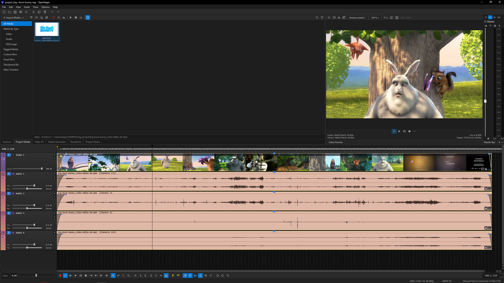

# OpenVegas

[](https://github.com/ili4yov-ika/OpenVegas/actions/workflows/ci.yml)

Открытый кроссплатформенный видеоредактор — аналог **VEGAS Pro 22** на **C++ / Qt 6.8** с лицензией **GNU GPL**.

Цель — воспроизвести привычный workspace Vegas (таймлайн, events, fades/crossfades, media bin, Trimmer, Properties) и уметь открывать проекты `.veg`.

Сейчас есть **кликабельный MVP** (оболочка + таймлайн + диалоги) и эталоны в `SAMPLES/`.

---

## Скриншот



---

## Стек

| Слой | Выбор |
|------|--------|
| Язык / UI | C++17+, Qt 6.8 (Widgets), `.ui` в `ui/` |
| Сборка | CMake 3.16+ |
| Компиляторы | MSVC 2022, GCC 9+, Clang 12+ |
| Медиа | позже: Qt Multimedia / FFmpeg |
| Лицензия | GNU GPL v3 or later ([LICENSE](LICENSE)) |

Планы и документация:

| Документ | Содержание |
|----------|------------|
| [`MARKDOWN/INIT.MD`](MARKDOWN/INIT.MD) | Правила разработки OpenVegas |
| [`MARKDOWN/ISSUES_AND_PLANS.md`](MARKDOWN/ISSUES_AND_PLANS.md) | Баги, stub, планы |
| [`MARKDOWN/VEG_READER_V0.md`](MARKDOWN/VEG_READER_V0.md) | Разбор открытия `.veg` (VegReader v0) |
| [`docs/VEG_OPEN.md`](docs/VEG_OPEN.md) | Краткая шпаргалка по Open `.veg` |
| [`MARKDOWN/QT68_PORT_AND_VEG_OPEN.md`](MARKDOWN/QT68_PORT_AND_VEG_OPEN.md) | Перенос UI на Qt + план парсера |
| [`SAMPLES/docs_veg/`](SAMPLES/docs_veg/README.md) | Реверс бинарного формата `.veg` |

---

## Сборка и запуск MVP

Требуется установленный **Qt 6.8+** (Widgets).

### Qt Creator (qmake)

Откройте [`OpenVegas.pro`](OpenVegas.pro), выберите kit **Qt 6.8+ Widgets** (MSVC 2022 / MinGW / Clang) и Build.

### CMake

```bash
# Windows MinGW (см. также cmake --preset windows-mingw-debug)
cmake -S . -B build/Windows_MinGW-x64 -DCMAKE_PREFIX_PATH=<путь-к-Qt6.8>
cmake --build build/Windows_MinGW-x64
```

Запуск (пример Windows):

```text
build\Windows_MinGW-x64\OpenVegas.exe
# или shadow-build из Creator
```

В интерфейсе: SVG-иконки из макетов, chrome как Vegas empty project, сплиттеры, **View → Load Demo Timeline** для демо-клипов, Alt+Enter / Ctrl+Shift+M, Preferences, Plug-In Chooser.

Опционально скопировать поддеревья Vegas в **игнорируемый** `build/.../vegas-runtime/`:

```bash
cmake -S . -B build/Windows_MinGW-x64 -DCMAKE_PREFIX_PATH=<Qt6.8> -DOPENVGAS_COPY_VEGAS_RUNTIME=ON
```

**Не коммитьте** `build/`, `vegas-runtime/` и бинарники Vegas — они в [`.gitignore`](.gitignore).

### CI (GitHub Actions)

На каждый push / PR в `main` workflow [`.github/workflows/ci.yml`](.github/workflows/ci.yml) собирает Release на **Ubuntu 22.04**, **Windows 2022** и **macOS 14** (Qt **6.8.3** Widgets+Svg) и запускает `ctest`.

---

## Структура репозитория

```
OpenVegas/
├── CMakeLists.txt
├── CMakePresets.json
├── .gitignore
├── ui/                   # Qt Designer .ui
├── src/                  # C++ MVP
├── resources/            # QSS, icons
├── tools/                # установщики, macOS/WSL, утилиты
├── MARKDOWN/             # планы для ИИ
├── docs/                 # Документация для репозитория
└── SAMPLES/              # HTML-макеты, .veg, снимок Program Files
```

| Путь | Назначение |
|------|------------|
| [`ui/`](ui/) | Окна и диалоги Designer |
| [`src/`](src/) | MainWindow, TimelineView, model, `io/VegReader`, plugins |
| [`tools/`](tools/README.md) | NSIS/deb/rpm, macOS/WSL, `svg_to_ico` |
| [`MARKDOWN/VEG_READER_V0.md`](MARKDOWN/VEG_READER_V0.md) | Открытие `.veg` (подробно) |
| [`docs/VEG_OPEN.md`](docs/VEG_OPEN.md) | Открытие `.veg` (кратко) |
| [`MARKDOWN/QT68_PORT_AND_VEG_OPEN.md`](MARKDOWN/QT68_PORT_AND_VEG_OPEN.md) | Перенос на Qt и план парсера |
| [`SAMPLES/`](SAMPLES/README.md) | Эталонные `.veg`, медиа и Vegas 22 |

---

## Эталоны Vegas

1. Проекты и медиа — [`SAMPLES/veg_project/README.md`](SAMPLES/veg_project/README.md)
2. Разбор `.veg` — [`SAMPLES/veg_analyzators/README.md`](SAMPLES/veg_analyzators/README.md)
3. Runtime Vegas 22 — [`SAMPLES/VEGAS-PRO-22-PROGRAM-FILES/README.md`](SAMPLES/VEGAS-PRO-22-PROGRAM-FILES/README.md)

---

## Документация

1. **Правила разработки** — [`MARKDOWN/INIT.MD`](MARKDOWN/INIT.MD)
2. **Баги и планы** — [`MARKDOWN/ISSUES_AND_PLANS.md`](MARKDOWN/ISSUES_AND_PLANS.md)
3. **Открытие `.veg` (кратко)** — [`docs/VEG_OPEN.md`](docs/VEG_OPEN.md)
4. **Поддерживаемые файлы** — [`docs/support_files.md`](docs/support_files.md)
5. **Открытие `.veg` (развёрнуто)** — [`MARKDOWN/VEG_READER_V0.md`](MARKDOWN/VEG_READER_V0.md)
6. **Перенос на Qt + план парсера** — [`MARKDOWN/QT68_PORT_AND_VEG_OPEN.md`](MARKDOWN/QT68_PORT_AND_VEG_OPEN.md)
7. **Формат `.veg`** — [`SAMPLES/docs_veg/00_format_overview.md`](SAMPLES/docs_veg/00_format_overview.md)
8. **Program Files Vegas 22** — [`SAMPLES/VEGAS-PRO-22-PROGRAM-FILES/README.md`](SAMPLES/VEGAS-PRO-22-PROGRAM-FILES/README.md)

---

## Лицензия

Код OpenVegas — **GNU GPL v3 or later**. Полный текст и оговорки: [`LICENSE`](LICENSE).

VEGAS Pro и материалы в `SAMPLES/VEGAS-PRO-22-PROGRAM-FILES/` принадлежат MAGIX/VEGAS и **не** покрываются этой GPL; они только справочные эталоны. Копии runtime (`build/vegas-runtime/`) не публиковать в git.
